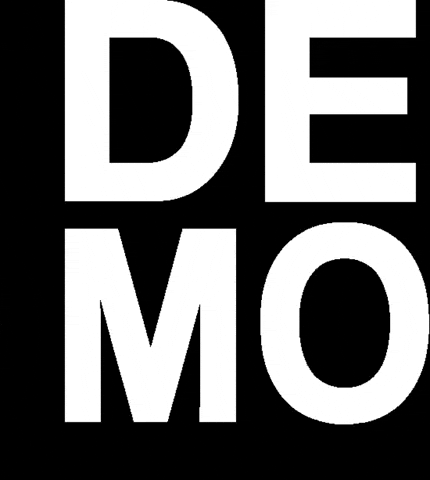

# ✨ Air Canvas

Draw in the air with your finger using **OpenCV + Mediapipe** ✍️

[](https://github.com/Khurram-Devs/Air-Canvas/releases)
[](LICENSE)


---

## 🚀 Features

- 🎯 Real-time **index finger tracking**
- 🖌️ Virtual drawing with **brush sizes (XS, S, M, L)**
- 🎨 **Color palette** (Red, Green, Blue, Yellow)
- ✋ **Eraser tool**
- ↩️ **Undo / Redo** support (up to 20 steps)
- 🧹 **Clear canvas** instantly
- 💾 **Save drawing** with auto **watermark + version info**
- ⚙️ **Settings screen** to enable/disable tools
- 🖼️ Dual-window: **Paint (with UI)** + **Output (canvas only)**
- ⚡ Lightweight and intuitive interface
- ✅ Error handling (missing webcam / metadata file)

---

## 🛠️ Tech Stack

- **Python** 🐍
- **OpenCV (`cv2`)** 👁️
- **Mediapipe** ✋
- **NumPy** 🔢

---

## 📂 Project Structure

```
air-canvas/
├── air_canvas.py        # Main script (entry point)
├── version.txt          # Metadata (AppName, Version, Github)
├── drawings/            # Saved outputs (auto-created)
├── requirements.txt     # Dependencies
├── README.md            # Documentation
└── samples/             # Screenshots / demo outputs
```

---

## ▶️ Installation & Usage

1. Clone the repository:

   ```bash
   git clone https://github.com/Khurram-Devs/Air-Canvas.git
   cd Air-Canvas
   ```

2. Install dependencies:

   ```bash
   pip install -r requirements.txt
   ```

3. Run the application:
   ```bash
   python main.py
   ```

---

## 🎮 Controls

### 🖱️ Gestures

- **Draw** → Keep index finger extended & move it
- **Pinch (thumb + index)** → Select buttons (colors, sizes, tools)
- **Eraser mode** → Toggle via button

### ⌨️ Keyboard Shortcuts

- `Q` → Quit
- `S` → Save (if enabled)
- `Z` → Undo (if enabled)
- `Y` → Redo (if enabled)

---

## 📸 Demo

Example placeholder:



---

## 🤝 Contributing

Contributions are welcome!  
Feel free to open issues or submit pull requests to improve this project.

---

## 📜 License

This project is licensed under the **MIT License** – you are free to use, modify, and distribute it.

---

✨ Made with ❤️ using OpenCV & Mediapipe